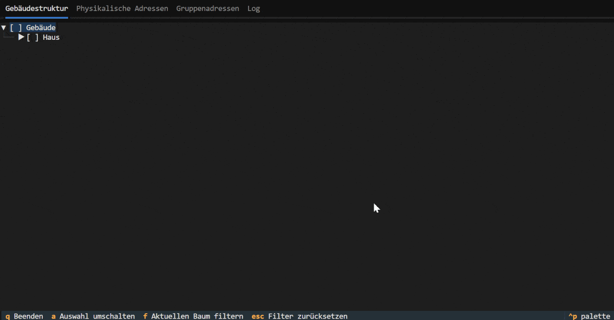
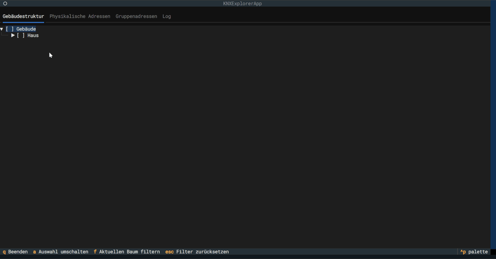

# KNX Lens Suite

This tool suite provides three powerful Python scripts for monitoring and analyzing KNX installations.

1.  **`knx-lens-logger.py`**: A robust logger that captures all KNX bus traffic, decodes telegrams using an ETS project file, and stores the data in rotating log files.

2.  **`knx-lens.py`**: An interactive TUI (Text-User-Interface) based explorer that lets you browse your `.knxproj` project file and intelligently filter the log files created by the logger.

3.  **`knx-lens-web.py`**: A web server that starts `knx-lens.py` and makes its interface accessible in any modern web browser.

Together, these tools enable detailed live monitoring and convenient post-analysis of bus traffic—both in the terminal and in the browser.




## Table of Contents

* [Features](#features)
* [Installation](#installation)
* [Configuration](#configuration)
    * [1. `knx-lens-logger.py` Setup (First Time)](#1-knx-lens-loggerpy-setup-first-time)
    * [2. Manually Edit the `.env` File](#2-manually-edit-the-env-file)
* [Usage](#usage)
    * [Step 1: Log Bus Traffic](#step-1-log-bus-traffic)
    * [Step 2: Explore Logs and Project in the Terminal](#step-2-explore-logs-and-project-in-the-terminal)
    * [Step 3: Explore Logs and Project in the Web Browser](#step-3-explore-logs-and-project-in-the-web-browser)
    * [Step 4: Running the Logger as a Systemd Service (Linux)](#step-4-running-the-logger-as-a-systemd-service-linux)
* [Troubleshooting](#troubleshooting)

## Features

### `knx-lens-logger.py`

* **Interactive Setup**: Guides the user through the configuration of the gateway and the log directory.
* **Automatic Gateway Detection**: Finds KNX/IP gateways on the local network.
* **Telegram Decoding**: Uses a `.knxproj` file to interpret group addresses, device names, and datapoint types (DPTs) to create human-readable logs.
* **Rotating Logs**: Creates daily log files (`knx_bus.log`) and automatically compresses older logs with gzip to save space.
* **Daemon Mode**: Can run as a background service for continuous logging.
* **Debugging**: Writes all internal actions and errors to a separate `knx_app_debug.log`.

### `knx-lens.py`

* **Interactive TUI**: A user-friendly command-line interface that can be operated without a mouse.
* **Multiple Views**: Browse your KNX project by:
    * **Building Structure** (e.g., Floor -> Room -> Device)
    * **Physical Addresses** (Line structure)
    * **Group Addresses** (Functional structure)
* **Intelligent Log Filtering**: Select individual devices, rooms, or functions in the explorer to specifically filter the logs created by `knx-lens-logger.py`.
* **Efficient Caching**: Parsing of the `.knxproj` file is cached to significantly speed up subsequent launches.
* **Live Search/Filter**: Filter the tree views in real-time to quickly find what you're looking for.

### `knx-lens-web.py`

* **Web Access**: Makes the full functionality of `knx-lens.py` available via a web interface.
* **Multi-User Capable**: Multiple users can access the explorer simultaneously through the browser.
* **Simple Start**: A single script starts the server and makes the application available on the local network.

## Installation

The tools require Python 3.8 or higher.

1.  **Clone or download the repository**:
    Ensure that you have the files `knx-lens-logger.py`, `knx-lens.py`, and `knx-lens-web.py` in one directory.

2.  **Create a Virtual Environment (Recommended)**:
    ```bash
    python -m venv .venv
    source .venv/bin/activate  # On Windows: .venv\Scripts\activate
    ```

3.  **Install Dependencies**:
    Create a file named `requirements.txt` with the following content:
    ```
    python-dotenv
    textual
    xknx
    xknxproject
    textual-serve
    ```
    Then, install them using pip:
    ```bash
    pip install -r requirements.txt
    ```

## Configuration

The configuration is stored centrally in a `.env` file in the same directory.

### 1. `knx-lens-logger.py` Setup (First Time)

The easiest way to configure the tools is by using the logger's interactive setup. Run it once:
```bash
python knx-lens-logger.py --setup
```
The script will guide you through the following steps:

* Selecting the gateway mode (save a specific gateway or search on every start).
* Scanning the network for gateways.
* Choosing a gateway.
* Specifying the directory where the `knx_bus.log` files should be saved.

The results will be automatically saved in your `.env` file.

### 2. Manually Edit the `.env` File

After the setup, your `.env` file should look something like this. You still need to add the path to your project file and the specific log file.
```dotenv
# For the logger: The directory where logs are created
LOG_PATH="C:/Users/YourUser/Documents/knx_logs"

# For the explorer: The full path to the current log file
KNX_LOG_FILE="C:/Users/YourUser/Documents/knx_logs/knx_bus.log"

# Gateway settings
KNX_GATEWAY_IP="192.168.1.23"
KNX_GATEWAY_PORT="3671"

# Project file settings
KNX_PROJECT_PATH="C:/path/to/your/project.knxproj"
KNX_PASSWORD="YOUR_PROJECT_PASSWORD" # Only fill in if the file is password-protected
```

**Important Environment Variables:**

* `LOG_PATH`: Path to the **directory** for `knx-lens-logger.py` to create its rotating logs.
* `KNX_LOG_FILE`: Full path to the specific **log file** (`knx_bus.log`) for `knx-lens.py` to read.
* `KNX_GATEWAY_IP`: IP address of the KNX/IP gateway. Can be set to `AUTO`.
* `KNX_GATEWAY_PORT`: Port of the gateway (usually `3671`).
* `KNX_PROJECT_PATH`: Full path to your `.knxproj` file.
* `KNX_PASSWORD`: The password for your `.knxproj` file, if it has one.

***Note on Windows Paths:*** *It is highly recommended to use forward slashes (`/`) instead of backslashes (`\`) for all paths to avoid errors.*

## Usage

### Step 1: Log Bus Traffic

To record the bus traffic, start `knx-lens-logger.py`. This is a prerequisite for analysis in Step 2 or 3.

* **For an interactive session (shows logs in the terminal):**
    ```bash
    python knx-lens-logger.py
    ```

* **As a background process (daemon mode, only writes to the file):**
    ```bash
    python knx-lens-logger.py --daemon &
    ```
    If necessary, stop the process with `kill <PID>`.

The logger now writes all telegrams to the `knx_bus.log` file inside the directory configured in `LOG_PATH`.

### Step 2: Explore Logs and Project in the Terminal

Once the logger is running and has collected some data, you can start the TUI explorer directly in your terminal:
```bash
python knx-lens.py
```
**Explorer Controls:**

* **Switch Tabs**: Use the arrow keys (left/right).
* **Navigate**: Arrow keys (up/down/left/right).
* **`a`**: Toggles the selection for the log filter.
* **`f`**: Filters the current tree view.
* **`Escape`**: Resets the tree filter.
* **`q`**: Quits the application.

### Step 3: Explore Logs and Project in the Web Browser

As an alternative to the terminal, you can also start the explorer via the web interface.

1.  **Start the web server:**
    ```bash
    python knx-lens-web.py
    ```
2.  **Open your browser** and go to the displayed address (usually `http://127.0.0.1:8080`). The operation in the browser is identical to that in the terminal.

3.  **(Optional) Making the web interface accessible on your local network:**
    By default, the web interface is only accessible on the computer it's running on. To make it accessible to other devices in your network, you need to edit `knx-lens-web.py`.
    Change the `server.serve()` call to bind to all network interfaces:
    
    *From:*
    ```python
    server.serve()
    ```
    *To:*
    ```python
    server.serve(host="0.0.0.0")
    ```
    After restarting `knx-lens-web.py`, you can access the interface using the IP address of the host machine (e.g., `http://192.168.1.100:8080`).


### Step 4: Running the Logger as a Systemd Service (Linux)

To automatically start the `knx-lens-logger.py` on a modern Debian-based system (like Raspberry Pi OS, Ubuntu, etc.), you can use `systemd`.

1.  **Create the Service File**:
    Create a new file named `knx-lens-logger.service` in the `/etc/systemd/system/` directory. You will need `sudo` rights to do this.
    ```bash
    sudo nano /etc/systemd/system/knx-lens-logger.service
    ```
    Paste the following content into the file:
    ```ini
    [Unit]
    Description=KNX Lens Logger Service
    After=network.target

    [Service]
    # IMPORTANT: Replace 'your_user' with your actual username.
    User=your_user
    Group=your_user

    # IMPORTANT: Replace '/path/to/knx-lens-suite' with the absolute path
    # where your scripts and .env file are located.
    WorkingDirectory=/path/to/knx-lens-suite

    # IMPORTANT: Full path to the python executable in your virtual environment.
    ExecStart=/path/to/knx-lens-suite/.venv/bin/python /path/to/knx-lens-suite/knx-lens-logger.py --daemon

    Restart=on-failure
    RestartSec=5

    [Install]
    WantedBy=multi-user.target
    ```
    **Crucially, you must replace the placeholder values** for `User`, `Group`, `WorkingDirectory`, and `ExecStart` with your specific paths and username.

2.  **Reload, Enable, and Start the Service**:
    After saving the file, run the following commands to make systemd aware of the new service, enable it to start on boot, and start it immediately:
    ```bash
    sudo systemctl daemon-reload
    sudo systemctl enable knx-lens-logger.service
    sudo systemctl start knx-lens-logger.service
    ```

3.  **Check the Service Status**:
    You can check if the service is running correctly with:
    ```bash
    sudo systemctl status knx-lens-logger.service
    ```
    To view the live logs from the service, use:
    ```bash
    journalctl -u knx-lens-logger.service -f
    ```

## Troubleshooting

* **"Project file not found"**: Check the `KNX_PROJECT_PATH` in your `.env` file.
* **"Log file not found"**: Check the `KNX_LOG_FILE` path in your `.env` file. It must point to the exact file being written by the logger.
* **"No gateway found"**: Ensure your computer is on the same network as the KNX/IP gateway and that no firewall is blocking UDP communication on port 3671.
* **"Permission Denied" when writing the log file**: Check the write permissions for the directory specified in `LOG_PATH`.
* **TUI looks strange**: Your terminal might not support advanced characters or colors. Try a modern terminal like Windows Terminal, iTerm2, or the default Linux terminal, or use the web interface.
* **Further Issues**: Take a look at the `knx_app_debug.log` file created by `knx-lens-logger.py`. It contains detailed information about the process and any errors that occurred.
